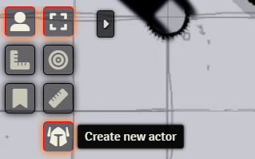
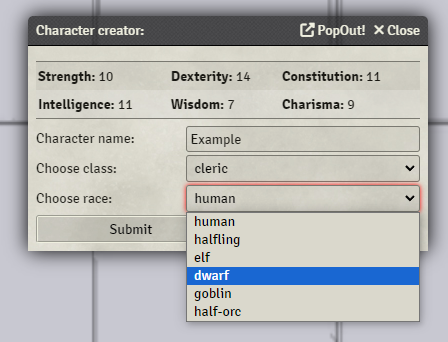

## Setup

This module currently can be only installed by downloading the files from github and unzipping the module folder directly into `FoundryVTT/Data/modules`.

## Creator

Character creator is a simple tool which you can initialize by clicking new button added to "Token Controls" menu.
 

Then your character's ability scores are rolled and displayed. Based on those scores you can choose your race and class. Name is not required, if you don't input anything into name field it will remain default.

Lastly, if either your race or class has option to choose from either racial talents or rolled level talents, a dialogue window will pop out to ask for your choice.
 

## Features

- New Token is automaticallty assigned to person who created it.
- Ability scores are automatically re-rolled if at least one of them is NOT 14 or more.
- Creator supports every class and race listed in FoundryVTT Shadowdark RPG system.
- HP is rolled automatically, dwarf rolls with advantage (rolls 2 times and assigns better result).
- Gold is rolled automatically according to rulebook formula (2d6 \* 5).
- Currently all tokens have 5ft darkvision, to allow them navigate in complete darkness as a form of awarness on "hand's reach".

## What next?

- Option to roll level 0 character
- Adding settings options to allow user for personalized adjustements in creation process
